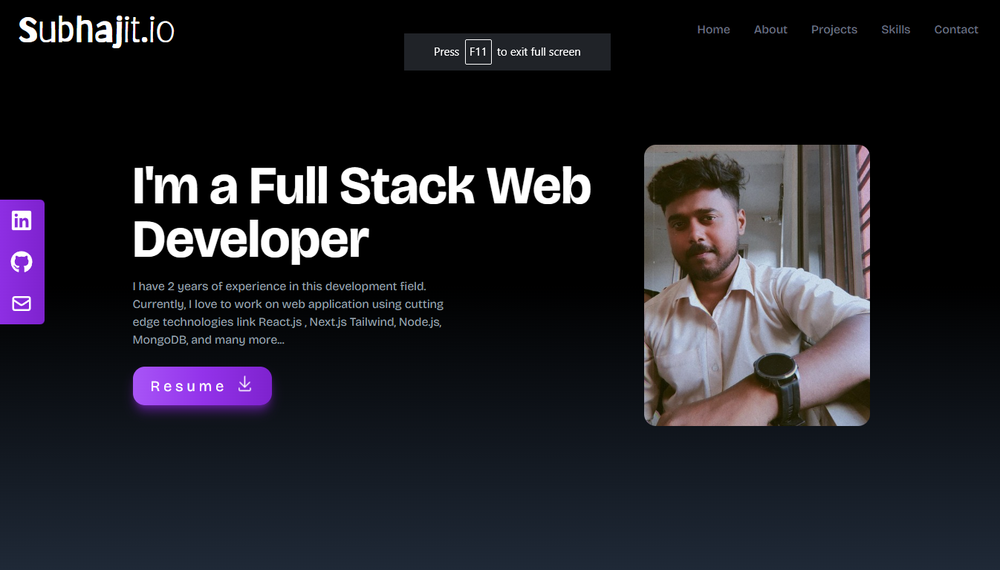

# My Portfolio Website

Welcome to my portfolio website! This project is a representation of my skills, projects, and experiences in the field of web development. The website is designed to provide an interactive and engaging way for you to learn more about me and my work.

## Table of Contents

- [Home](#home)
- [About](#about)
- [Projects](#projects)
- [Skills](#skills)
- [Technologies Used](#technologies-used)
- [Contact](#contact)

## Home

The home section introduces you to the essence of my portfolio. It's the starting point where you can get a quick overview of what to expect and easily navigate to other sections.

## About

In the about section, you'll find insights into my journey, background, and passion for web development. Discover the story behind my enthusiasm for creating exceptional online experiences.

## Projects

Explore the projects that I've worked on, each showcasing a unique set of challenges and solutions. From web applications to creative experiments, you'll find a variety of examples that demonstrate my skills and creativity.

## Skills

The skills section highlights my technical expertise. From programming languages to frameworks and tools, you'll get an insight into the technologies I'm proficient in. It's a testament to the foundation I've built for crafting innovative web solutions.

## Technologies Used

I've built this portfolio website using cutting-edge technologies to ensure a seamless and visually appealing user experience. The main technologies used are:

- **React:** A powerful JavaScript library for building dynamic and interactive user interfaces.

- **Tailwind CSS:** A utility-first CSS framework that helps create responsive and stylish designs with ease.

## Contact

I believe in the power of collaboration and networking. Connect with me on [LinkedIn](https://www.linkedin.com/in/your-profile), explore my code on [GitHub](https://github.com/your-username), or drop me a direct message at [your@email.com](mailto:your@email.com).

Looking forward to connecting with fellow developers, collaborators, and potential clients!

## Get in Touch

If you'd like to get in touch, you can also use the contact form on my portfolio website. Just visit [Contact Me](https://your-portfolio-website.com/contact) to leave a message, and I'll get back to you as soon as possible.

---

Thank you for visiting my portfolio website. I hope you enjoy browsing through my work and learning more about my journey in web development. Feel free to reach out if you have any questions or if you're interested in collaborating on future projects!
